{width="0.5236111111111111in"
height="0.5847211286089239in"}

**instructables**

{width="0.5097222222222222in"
height="0.5097211286089239in"}

> by

This is a very interesting yet simple project for controlling ac
appliances through phone calls. We called this project a \"Smart Device
Controller\".

**Supplies:**

> All the necessary things used for making this project are listed in
> images.

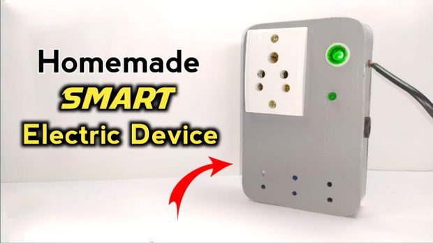{width="7.477777777777778in"
height="4.208333333333333in"}

**Step 1: STORY**

> Smart Device Controller

This is a very interesting yet simple project for controlling ac
appliances through phone calls. We called this project a \"Smart Device
Controller\".

Smart Device Controller: Page 1

By following this guide, you will be able to know and make your Smart
Device Controller. This project guide contains the�les necessary to help
you step by step produce your own Smart Device Controller. Please follow
the steps of the project to get a positive result.

> Disclaimer: Be extra careful with this project as it produces a High
> Voltage - High Current output.
>
> Step 1: Get your PCB ready!
>
> Talking About Electronics
>
> After making the circuit diagram I transformed it into a PCB design to
> produce it, to produce the PCB, I have chosen JLCPCB the best PCB
> supplier and the cheapest PCB provider to order my circuit. with the
> reliable platform, all I need to do is some simple clicks to upload
> the Gerber �le and set some parameters like the PCB thickness color
> and quantity. I've paid just 2 Dollars to get my PCB after �ve days
> only, what I have noticed about JLCPCB this time is the
> \"out-of-charge PCB color\" which means you will pay only 2 USD for
> any PCB color you choose.

{width="0.1388888888888889in"
height="0.1527777777777778in"}

{width="0.1388888888888889in"
height="0.1527777777777778in"}

> Related Download Files As you can see in the pictures above the PCB is
> very well manufactured and I've got the same PCB design that we've
> made for our main board and all the labels and logos are there to
> guide me during the soldering steps. You can also download the Gerber
> �le for this circuit from the download link below in case you want to
> place an order for the same circuit design.
>
> Step 2: Get all the Components Listed in the images.
>
> Step 3: Place all the components on PCB and solder it properly.
>
> Step 4: After soldering the components to PCB, connect the 9volt
> battery connector to the PCB.
>
> Step 5: Solder the wires to the backlight of your old keypad phone as
> shown in the images. Connect other ends of the same wire to the dc
> jack.

{width="0.1388888888888889in"
height="0.1527777777777778in"}

{width="0.1388888888888889in"
height="0.3611111111111111in"}

> Step 6: Screw the three-pin socket to your custom-designed PVC sheet
> Box & also connect the dc female jack.Solder dc jack wire to the Pcb.
>
> Solder and do all the connections of ac plug wires and ac indicator
> carefully as shown in images.
>
> Connect the 9-volt battery to the Pcb and place it inside the box
> using double-sided tape.
>
> .And BOOM! All the connections are done, it\'s time to cover the body
> with another PVC sheet.
>
> Final step: Connect the 12v adapter to the circuit, also connect the
> keypad phone to the circuit & Smart Device Controller is now ready to
> power up your Small Ac appliances.

Smart Device Controller: Page 2

New users will also get a \$30 coupon while registering at JLCPCB via
this blue link. Thank you for reading this guide, hopefully, this guide
provides full steps to help you to create your own Smart Device
Controller. If you have any questions please post them in the comment
section below.

{width="7.477777777777778in"
height="4.208333333333333in"}

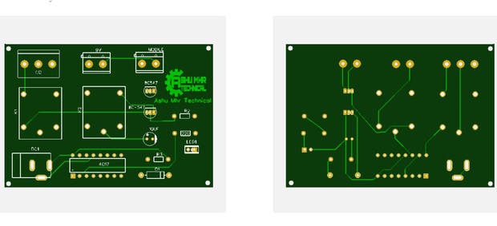{width="7.477777777777778in"
height="3.4125in"}

Smart Device Controller: Page 3

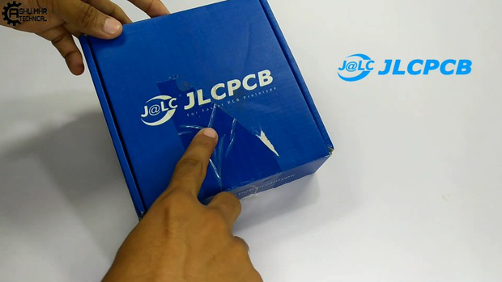{width="7.477777777777778in"
height="4.208333333333333in"}

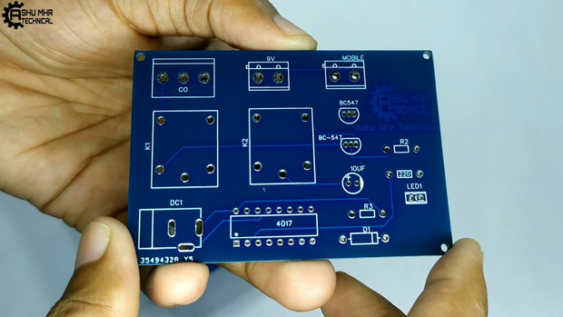{width="7.477777777777778in"
height="4.208333333333333in"}

Smart Device Controller: Page 4

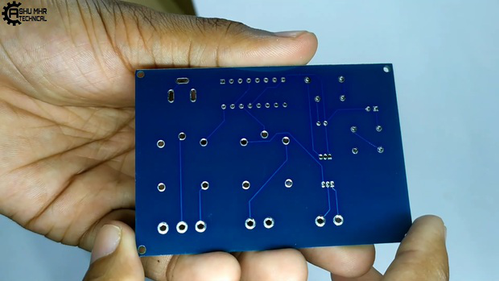{width="7.477777777777778in"
height="4.208333333333333in"}

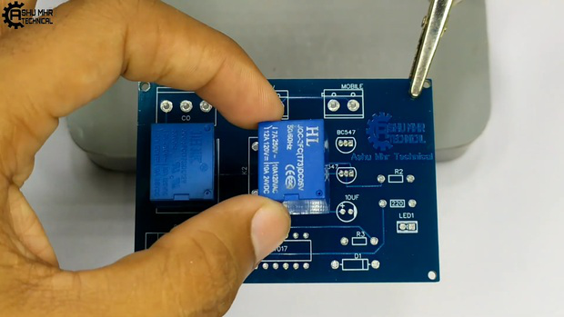{width="7.477777777777778in"
height="4.208333333333333in"}

Smart Device Controller: Page 5

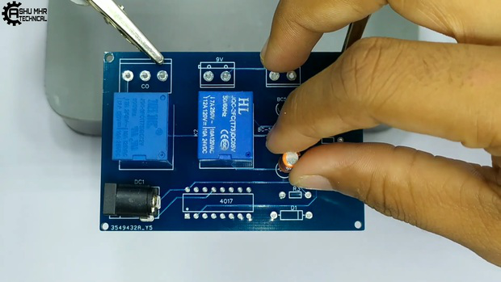{width="7.477777777777778in"
height="4.208333333333333in"}

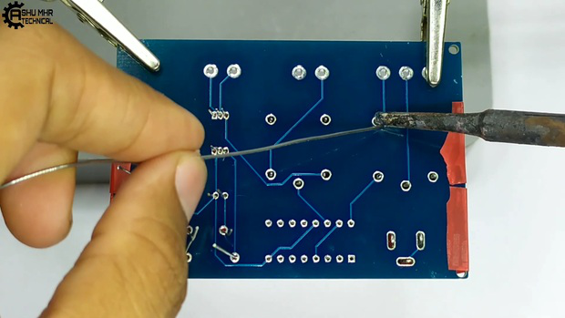{width="7.477777777777778in"
height="4.208333333333333in"}

Smart Device Controller: Page 6

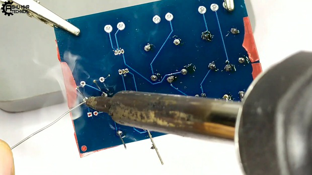{width="7.477777777777778in"
height="4.208333333333333in"}

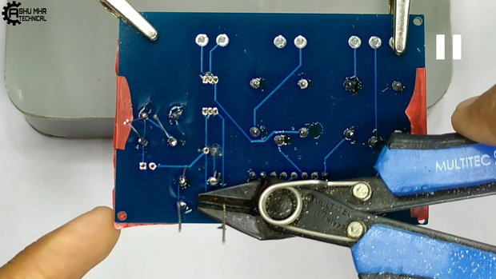{width="7.477777777777778in"
height="4.208333333333333in"}

Smart Device Controller: Page 7

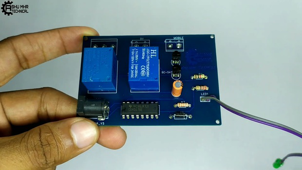{width="7.477777777777778in"
height="4.208333333333333in"}

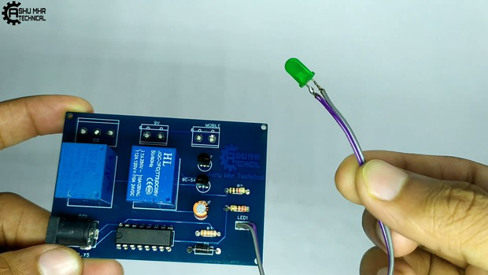{width="7.477777777777778in"
height="4.208333333333333in"}

Smart Device Controller: Page 8

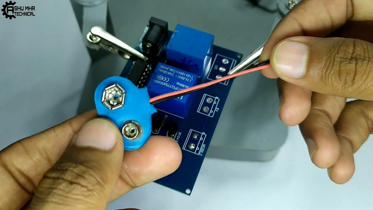{width="7.477777777777778in"
height="4.208333333333333in"}

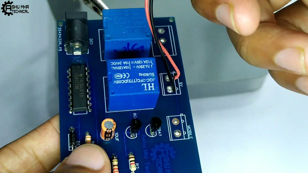{width="7.477777777777778in"
height="4.208333333333333in"}

Smart Device Controller: Page 9

{width="7.477777777777778in"
height="4.208333333333333in"}

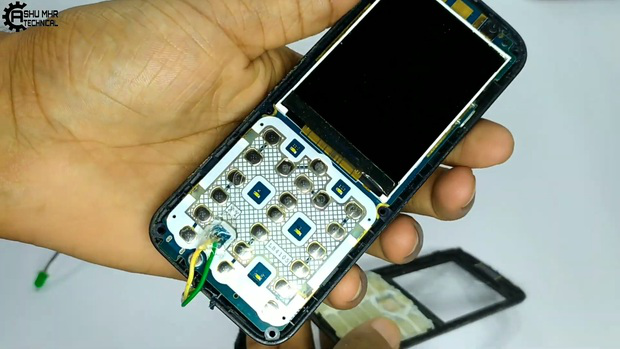{width="7.477777777777778in"
height="4.208333333333333in"}

Smart Device Controller: Page 10

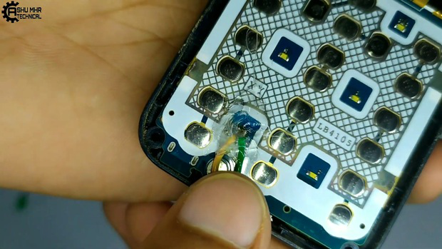{width="7.477777777777778in"
height="4.208333333333333in"}

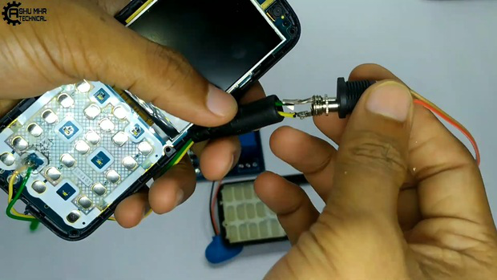{width="7.477777777777778in"
height="4.208333333333333in"}

Smart Device Controller: Page 11

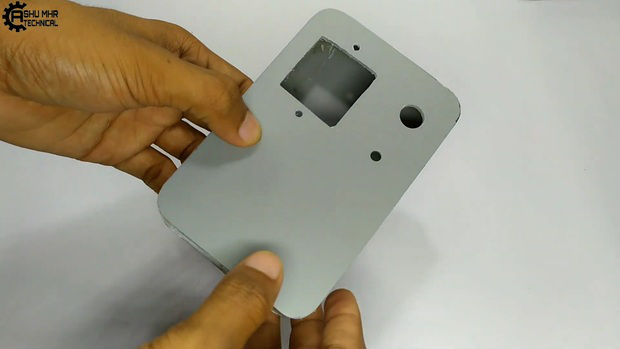{width="7.477777777777778in"
height="4.208333333333333in"}

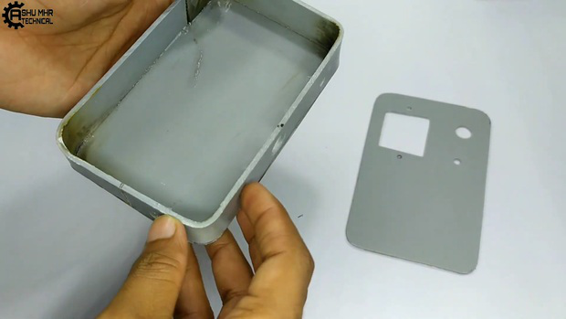{width="7.477777777777778in"
height="4.208333333333333in"}

Smart Device Controller: Page 12

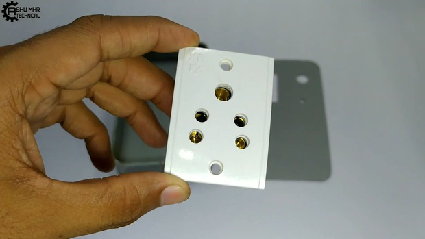{width="7.477777777777778in"
height="4.208333333333333in"}

{width="7.477777777777778in"
height="4.208333333333333in"}

Smart Device Controller: Page 13

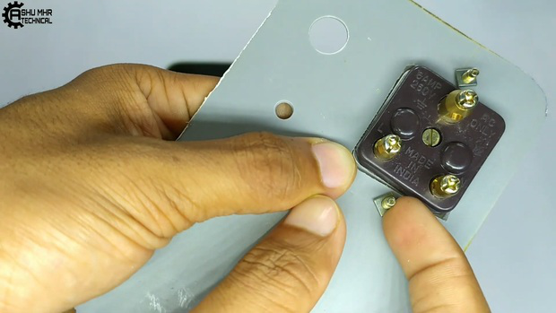{width="7.477777777777778in"
height="4.208333333333333in"}

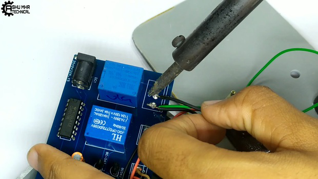{width="7.477777777777778in"
height="4.208333333333333in"}

Smart Device Controller: Page 14

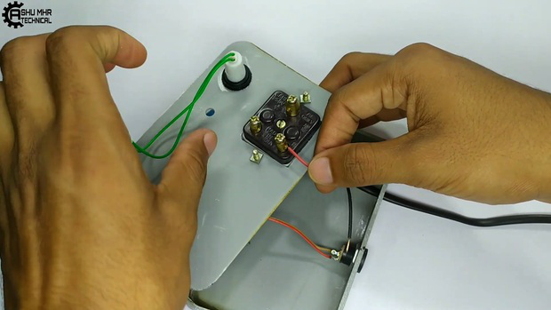{width="7.477777777777778in"
height="4.208333333333333in"}

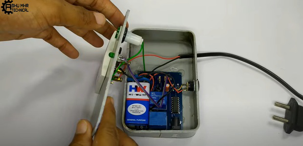{width="7.477777777777778in"
height="3.6027766841644793in"}

Smart Device Controller: Page 15

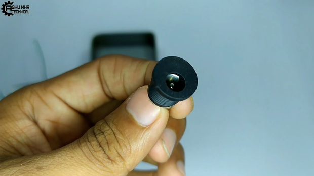{width="7.477777777777778in"
height="4.208333333333333in"}

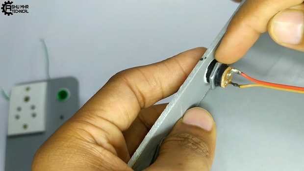{width="7.477777777777778in"
height="4.208333333333333in"}

Smart Device Controller: Page 16

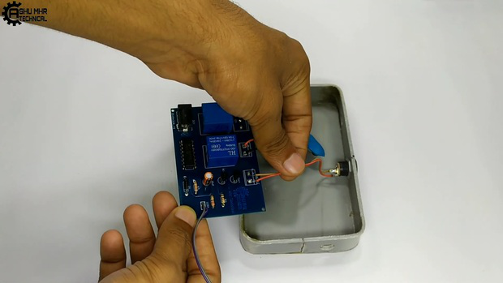{width="7.477777777777778in"
height="4.208333333333333in"}

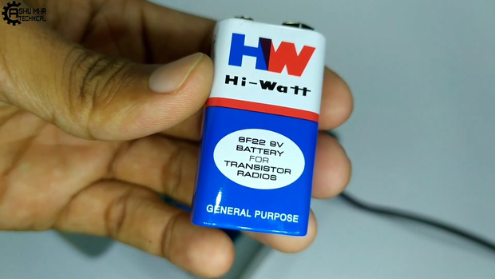{width="7.477777777777778in"
height="4.208333333333333in"}

Smart Device Controller: Page 17

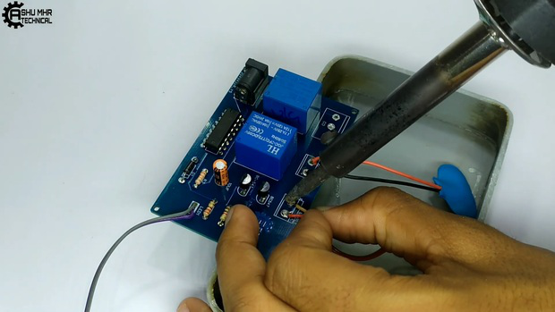{width="7.477777777777778in"
height="4.208333333333333in"}

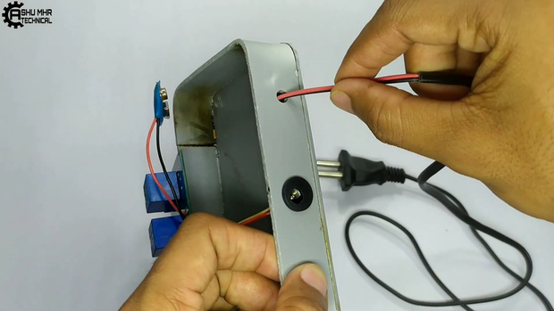{width="7.477777777777778in"
height="4.208333333333333in"}

Smart Device Controller: Page 18

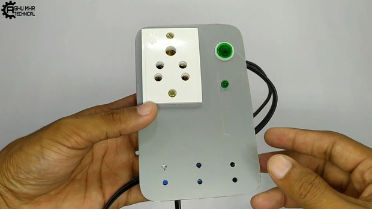{width="7.477777777777778in"
height="4.208333333333333in"}

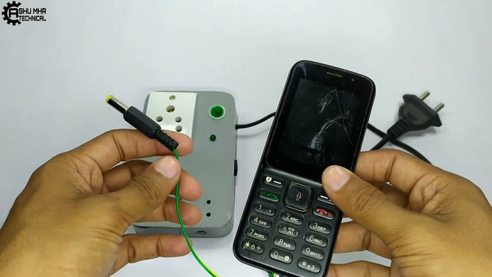{width="7.477777777777778in"
height="4.208333333333333in"}

Smart Device Controller: Page 19

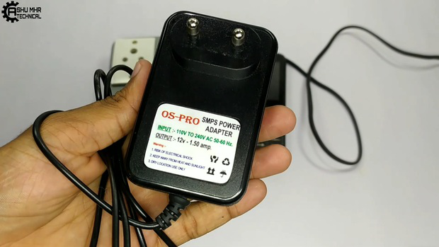{width="7.477777777777778in"
height="4.208333333333333in"}

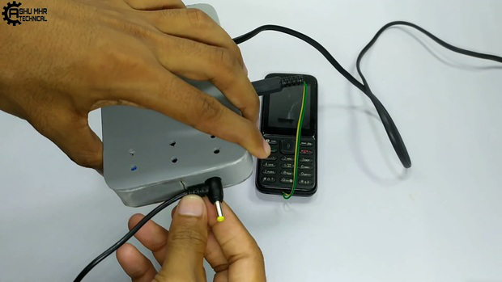{width="7.477777777777778in"
height="4.208333333333333in"}

Smart Device Controller: Page 20

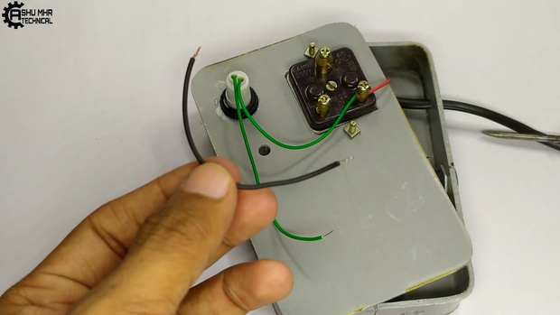{width="7.477777777777778in"
height="4.208333333333333in"}

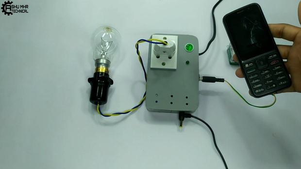{width="7.477777777777778in"
height="4.208333333333333in"}

Smart Device Controller: Page 21

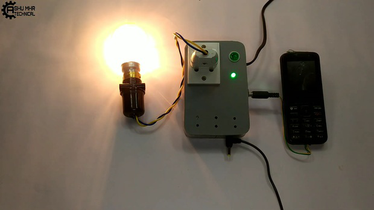{width="7.477777777777778in"
height="4.208333333333333in"}

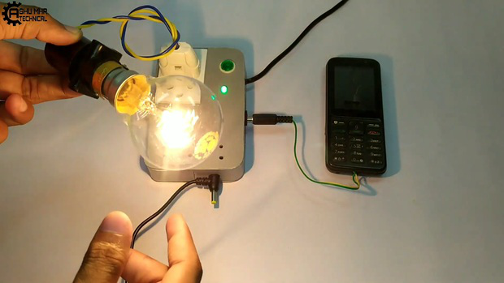{width="7.477777777777778in"
height="4.208333333333333in"}

Smart Device Controller: Page 22

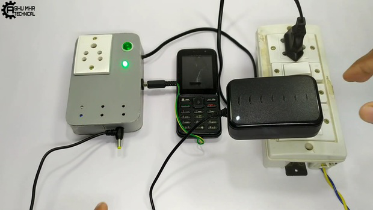{width="7.477777777777778in"
height="4.208333333333333in"}

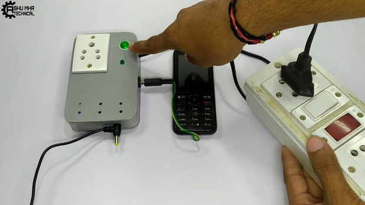{width="7.477777777777778in"
height="4.208333333333333in"}

Smart Device Controller: Page 23

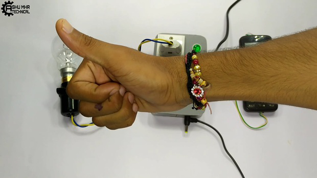{width="7.477777777777778in"
height="4.208333333333333in"}

Smart Device Controller: Page 24
